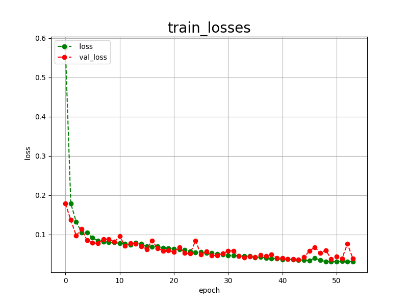
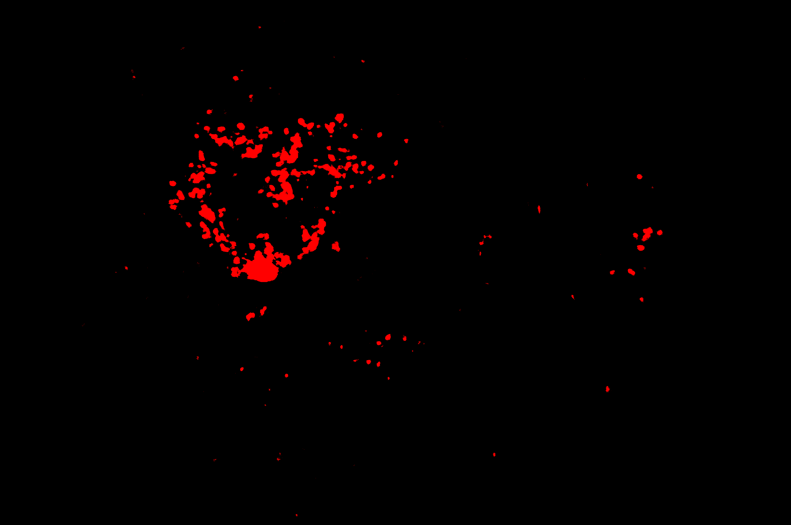

<h2>TensorFlow-FlexUNet-Tiled-Image-Segmentation-IDRiD-HardExudates (2025/10/02)</h2>

This is the first experiment of Image Segmentation for Indian Diabetic Retinopathy (IDRiD) HardExudates Images, 
 based on our 
 <a href="https://github.com/sarah-antillia/TensorFlow-FlexUNet-Image-Segmentation-Model">
<b>TensorFlowFlexUNet (TensorFlow Flexible UNet Image Segmentation Model for Multiclass)</b></a>
, and a 512x512 pixels 
<a href="https://drive.google.com/file/d/1NWq2tFInZb8dqSAr-k3DpJJipA9DflwQ/view?usp=sharing">
<b>Augmented-Tiled-IDRiD-HardExudates-PNG-ImageMask-Dataset.zip</b></a>.
which was derived by us from 
  
<a href="https://ieee-dataport.org/open-access/indian-diabetic-retinopathy-image-dataset-idrid">
<b>
Indian Diabetic Retinopathy Image Dataset (IDRiD)
</b>
</a>
  
<b>Experiment Strategies</b> 
In this experiment, we employed the following strategies.
 
<b>1. Tiled ImageMask Dataset</b> 
We trained and validated a TensorFlow UNet model using the Tiled-IDRiD-HardExudates-ImageMask-Dataset, which was tiledly-splitted to 512x512 pixels 
and reduced to 512x512 pixels image and mask dataset from the original 4288x2848 pixels images and mask files. 
 
<b>2. Tiled Image Segmentation</b> 
We applied our Tiled-Image Segmentation inference method to predict the HardExudates regions for the mini_test images 
with a resolution of 4288x2848 pixels.  
On a singlelcass segmentation model, please refer to our experiment 
<a href="https://github.com/sarah-antillia/Tensorflow-Tiled-Image-Segmentation-IDRiD-HardExudates">
<b>Tensorflow-Tiled-Image-Segmentation-IDRiD-HardExudates</b></a>
  

<b>Acutual Tiled Image Segmentation for IDRiD-HardExudates Images of 4288x2848 pixels</b> 
As shown below, the inferred masks predicted by our segmentation model trained on the 
PNG dataset appear similar to the ground truth masks, but lack precision in some areas,.
 
<table>
<tr>
<th>Input: image</th>
<th>Mask (ground_truth)</th>
<th>Prediction: inferred_mask</th>
</tr>
<tr>
<td></td>
<td></td>
<td></td>
</tr>

<tr>
<td></td>
<td></td>
<td></td>
</tr>

<tr>
<td></td>
<td></td>
<td></td>
</tr>

</table>

 
<h3>1 Dataset Citation</h3>
The dataset used here was obtained from the following <b>IEEE DataPort</b> web site 
<a href="https://ieee-dataport.org/open-access/indian-diabetic-retinopathy-image-dataset-idrid">
<b>
Indian Diabetic Retinopathy Image Dataset (IDRiD)
</b>
</a>
  
Please see also <a href="https://idrid.grand-challenge.org/">
<b>DIABETIC RETINOPATHY: SEGMENNTATION AND GRAND CHALLENGE</b> </a>
 
 
<b>Citation Author(s):</b> 
Prasanna Porwal, Samiksha Pachade, Ravi Kamble, Manesh Kokare, Girish Deshmukh,  
Vivek Sahasrabuddhe, Fabrice Meriaudeau, 
April 24, 2018, "Indian Diabetic Retinopathy Image Dataset (IDRiD)", IEEE Dataport,  
 
DOI: <a href="https://dx.doi.org/10.21227/H25W98">https://dx.doi.org/10.21227/H25W98</a> 
 
<b>License:</b> 
<a href="http://creativecommons.org/licenses/by/4.0/">
Creative Commons Attribution 4.0 International License.
</a>
 
 
<h3>
2 Tiled-IDRiD-HardExudates ImageMask Dataset
</h3>
 If you would like to train this Tiled-IDRiD-HardExudates Segmentation model by yourself,
 please download the 512x512 pixels dataset
<a href="https://drive.google.com/file/d/1NWq2tFInZb8dqSAr-k3DpJJipA9DflwQ/view?usp=sharing">
Augmented-Tiled-IDRiD-HardExudates-PNG-ImageMask-Dataset.zip</a> on the google drive, 
expand the downloaded ImageMaskDataset and put it under <b>./dataset</b> folder to be
<pre>
./dataset
└─Tiled-IDRiD-HardExudates
    ├─test
    │   ├─images
    │   └─masks
    ├─train
    │   ├─images
    │   └─masks
    └─valid
        ├─images
        └─masks
</pre>
 
<b>Tiled-IDRiD-HardExudates Statistics</b> 
 
 

<!--
<li><a href="./generator/TiledImageMaskDatasetGenerator.py">TiledImageMaskDatasetGenerator.py</a></li>
<li><a href="./generator/split_master.py">split_master.py</a></li>
 
-->

 
As shown above, the number of images of train and valid datasets is not so large to use for a training set of our segmentation model.
 
 
On the derivation of this augmented dataset, please refer to our experiment: 
<a href="https://github.com/sarah-antillia/Tensorflow-Tiled-Image-Segmentation-IDRiD-HardExudates">
<b>Tensorflow-Tiled-Image-Segmentation-IDRiD-HardExudates</b></a>
 
 
<b>Train_images_sample</b> 

 
<b>Train_masks_sample</b> 

 
<h3>
3 Train TensorFlowFlexUNet Model
</h3>
 We trained Tiled-IDRiD-HardExudates TensorFlowFlexUNet Model by using the following
<a href="./projects/TensorFlowFlexUNet/Tiled-IDRiD-HardExudates/train_eval_infer.config"> <b>train_eval_infer.config</b></a> file.  
Please move to ./projects/TensorFlowFlexUNet/Tiled-IDRiD-HardExudates and run the following bat file. 
<pre>
>1.train.bat
</pre>
, which simply runs the following command. 
<pre>
>python ../../../src/TensorFlowFlexUNetTrainer.py ./train_eval_infer.config
</pre>

<b>Model parameters</b> 
Defined a small <b>base_filters = 16 </b> and large <b>base_kernels = (9,9)</b> for the first Conv Layer of Encoder Block of 
<a href="./src/TensorFlowFlexUNet.py">TensorFlowFlexUNet.py</a> 
and a large num_layers (including a bridge between Encoder and Decoder Blocks).
<pre>
[model]
;You may specify your own UNet class derived from our TensorFlowFlexModel
model         = "TensorFlowFlexUNet"
generator     =  False
image_width    = 512
image_height   = 512
image_channels = 3
num_classes    = 2

base_filters   = 16
base_kernels   = (9,9)
num_layers     = 8
dropout_rate   = 0.04
dilation       = (3,3)
</pre>
<b>Learning rate</b> 
Defined a very small learning rate.  
<pre>
[model]
learning_rate  = 0.00005
</pre>
<b>Loss and metrics functions</b> 
Specified "categorical_crossentropy" and <a href="./src/dice_coef_multiclass.py">"dice_coef_multiclass"</a>. 
<pre>
[model]
loss           = "categorical_crossentropy"
metrics        = ["dice_coef_multiclass"]

</pre>
<b>Dataset class</b> 
Specifed <a href="./src/ImageCategorizedMaskDataset.py">ImageCategorizedMaskDataset</a> class. 
<pre>
[dataset]
class_name    = "ImageCategorizedMaskDataset"
</pre>
 
<b>Learning rate reducer callback</b> 
Enabled learing_rate_reducer callback, and a small reducer_patience.
<pre> 
[train]
learning_rate_reducer = True
reducer_factor     = 0.5
reducer_patience   = 4
</pre>
<b>Early stopping callback</b> 
Enabled early stopping callback with patience parameter.
<pre>
[train]
patience      = 10
</pre>

<b>RGB Color map</b> 
rgb color map dict for Tiled-IDRiD-HardExudates 1+1 classes. 
<pre>
[mask]
; 1+1 classes
; RGB colors    HardExudates:red     
rgb_map = {(0,0,0):0,(255,0,0):1,}
</pre>

<b>Tiled Inference</b> 
<pre>
[tiledinfer] 
overlapping = 64
images_dir    = "./mini_test/images/"
output_dir    = "./mini_test_output_tiled/"
</pre>

<b>Epoch change tiled inference callback</b> 
Enabled <a href="./src/EpochChangeTiledInferencer.py">epoch_change_tiled_infer callback (EpochChangeTiledInferencer.py)</a></b>. 
<pre>
[train]
epoch_change_tiled_infer     = True
epoch_change_tiled_infer_dir =  "./epoch_change_tiled_infer"

num_infer_images         = 6
</pre>

By using this callback, on every epoch_change, the tiled inference procedure can be called
 for 6 images in <b>images_dir</b> folder specified by <b>tiledinfer</b> section. 
 This will help you confirm how the predicted mask changes 
 at each epoch during your training process.    

<b>Epoch_change_inference output at starting (epoch 1,2,3,4)</b> 
 
 
<b>Epoch_change_inference output at middlepoint (epoch 24,25,26,27)</b> 
 
 
<b>Epoch_change_inference output at ending (epoch 51,52,53,54)</b> 
 
 
In this experiment, the training process was terminated at epoch 54.  
 
 

<a href="./projects/TensorFlowFlexUNet/Tiled-IDRiD-HardExudates/eval/train_metrics.csv">train_metrics.csv</a> 
 

 
<a href="./projects/TensorFlowFlexUNet/Tiled-IDRiD-HardExudates/eval/train_losses.csv">train_losses.csv</a> 
 

 

<h3>
4 Evaluation
</h3>
Please move to <b>./projects/TensorFlowFlexUNet/Tiled-IDRiD-HardExudates</b> folder,
 and run the following bat file to evaluate TensorFlowFlexUNet model for Tiled-IDRiD-HardExudates. 
<pre>
./2.evaluate.bat
</pre>
This bat file simply runs the following command.
<pre>
python ../../../src/TensorFlowFlexUNetEvaluator.py ./train_eval_infer.config
</pre>

Evaluation console output: 

  

<a href="./projects/TensorFlowFlexUNet/Tiled-IDRiD-HardExudates/evaluation.csv">evaluation.csv</a> 
The loss (categorical_crossentropy) to this Tiled-IDRiD-HardExudates/test was not so low, but dice_coef_multiclass 
high as shown below.
 
<pre>
categorical_crossentropy,0.0322
dice_coef_multiclass,0.9826</pre>
 

<h3>
5 Inference
</h3>
Please move <b>./projects/TensorFlowFlexUNet/Tiled-IDRiD-HardExudates</b> folder
, and run the following bat file to infer segmentation regions for images by the Trained-TensorFlowFlexUNet model for Tiled-IDRiD-HardExudates. 
<pre>
./4.tiled_infer.bat
</pre>
This simply runs the following command.
<pre>
python ../../../src/TensorFlowFlexUNetTiledInferencer.py ./train_eval_infer.config
</pre>

<b>mini_test_images</b> 
 
<b>mini_test_mask(ground_truth)</b> 
 

<b>Inferred test masks</b> 
 
 

<b>Enlarged images and masks of IDRiD-HardExudates Images of 4288x2848 pixels</b> 
<table>
<tr>
<th>Image</th>
<th>Mask (ground_truth)</th>
<th>Tiled-inferred-mask</th>
</tr>

<tr>
<td></td>
<td></td>
<td></td>
</tr>
<tr>
<td></td>
<td></td>
<td></td>
</tr>
<tr>
<td></td>
<td></td>
<td></td>
</tr>
<tr>
<td></td>
<td></td>
<td></td>
</tr>
<tr>
<td></td>
<td></td>
<td></td>
</tr>
<tr>
<td></td>
<td></td>
<td></td>
</tr>
<tr>
<td></td>
<td></td>
<td></td>
</tr>
</table>

 
<h3>
References
</h3>
<b>1. IDRiD: Diabetic Retinopathy – Segmentation and Grading Challenge</b> 
Prasanna Porwal
, 
Samiksha Pachade, Manesh Kokare, Girish Deshmukh, Jaemin Son, Woong Bae, Lihong Liu 
, Jianzong Wang, Xinhui Liu, Liangxin Gao, TianBo Wu, Jing Xiao, Fengyan Wang , 
Baocai Yin, Yunzhi Wang, Gopichandh Danala, Linsheng He, Yoon Ho Choi, Yeong Chan Lee 
, Sang-Hyuk Jung,Fabrice Mériaudeau 
 
DOI:<a href="https://doi.org/10.1016/j.media.2019.101561">https://doi.org/10.1016/j.media.2019.101561</a>
 
<a href="https://www.sciencedirect.com/science/article/abs/pii/S1361841519301033">
https://www.sciencedirect.com/science/article/abs/pii/S1361841519301033</a>
 
 

<b>2. Tensorflow-Tiled-Image-Segmentation-IDRiD-HardExudates</b> 
Toshiyuki Arai antillia.com 
<a href="https://github.com/sarah-antillia/Tensorflow-Tiled-Image-Segmentation-IDRiD-HardExudates">
https://github.com/sarah-antillia/Tensorflow-Tiled-Image-Segmentation-IDRiD-HardExudates
</a>
 
 

